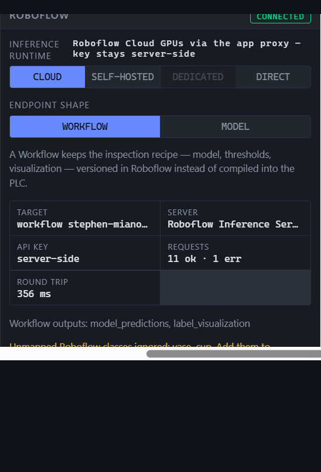
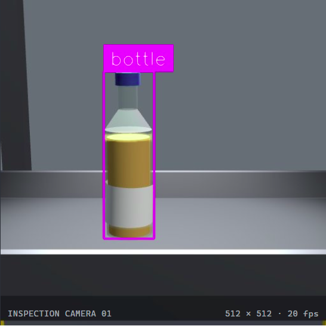
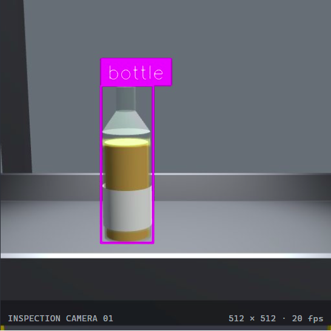
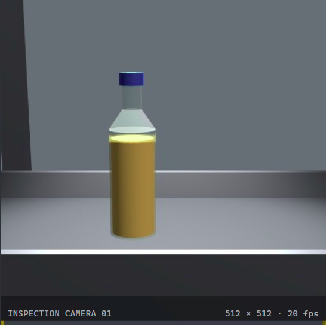
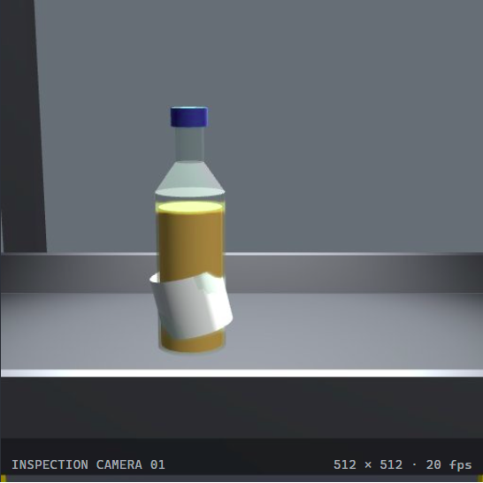
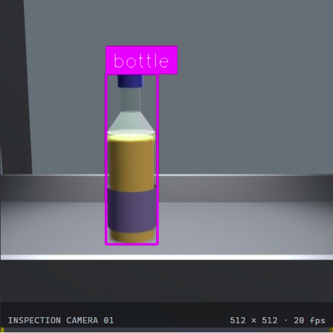
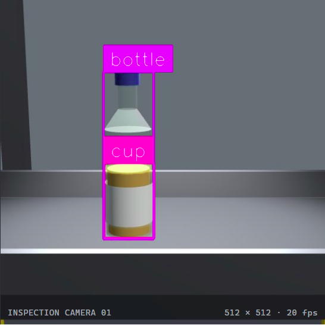

# Roboflow Image Processing Catalog

Captured on 2026-09-17 from the active Workflow configuration.

## Active Configuration

- Runtime: Roboflow Cloud through the application proxy
- Transport: `WORKFLOW`
- Workflow: `stephen-miano/bottle-inspection`
- Server: Roboflow Inference Server `1.6.0-post1`
- Workflow outputs: `model_predictions`, `label_visualization`
- Configured direct-model fallback: `coco/3`
- Application detection threshold: 50%
- Application unknown threshold: 35%
- Simulation speed: 1x for every cataloged result

The Workflow response does not expose its internal model version. `coco/3` is both the
locally configured direct-model reference and the model recorded for this Workflow in the
Phase 6 project notes. Keep that distinction when comparing a future Workflow revision.

## Results

| Simulator truth | Workflow visualization | Visible Workflow labels | Normalized result | Confidence | Latency |
|---|---|---|---|---:|---:|
| Good product | [Screenshot](01-good-product.png) | `bottle` | `UNKNOWN` | 0.0% | 434 ms |
| Missing cap | [Screenshot](02-missing-cap.png) | `bottle` | `UNKNOWN` | 0.0% | 324 ms |
| Missing label | [Screenshot](03-missing-label.png) | None | `UNKNOWN` | 0.0% | 278 ms |
| Crooked label | [Screenshot](04-crooked-label.png) | None | `UNKNOWN` | 0.0% | 258 ms |
| Wrong label | [Screenshot](05-wrong-label.png) | `bottle` | `UNKNOWN` | 0.0% | 356 ms |
| Underfill | [Screenshot](06-underfill.png) | `bottle`, `cup` | `UNKNOWN` | 0.0% | 389 ms |

### Good Product

### Missing Cap

### Missing Label

### Crooked Label

### Wrong Label

### Underfill

## Capture Notes

Each image is the Roboflow Workflow's `label_visualization` output for a separately
injected simulator truth class. Automatic production was disabled so no random product
could enter the sample set.

One initial good-product request was attempted at 5x simulation speed and hit the 850 ms
transport deadline. It is recorded in `manifest.json` but is not one of the six cataloged
screenshots. The successful good-product sample was repeated at 1x on the warm path.

All six successful samples became `UNKNOWN` because no configured class survived the
application's decision rules. The Workflow also emitted the unmapped COCO classes `vase`
and `cup` during the wider capture session; `cup` is visible in the underfill screenshot.