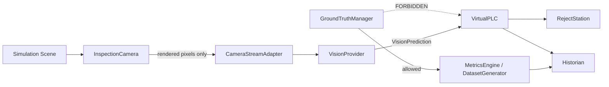

# Implementation Plan — Virtual Vision Cell

**Source of truth:** [functional_spec.md](functional_spec.md)
**Stack:** Vite + React 18 + TypeScript (strict) + Three.js
**Delivery model:** 10 sequential phases, each independently buildable, testable, and demoable.

---

## 0. Guiding Constraints (apply to every phase)

These are non-negotiable and every PR/commit must be checked against them.

| # | Rule | Enforcement mechanism |
|---|------|-----------------------|
| C1 | Ground truth never reaches `vision/` or `controls/` | ESLint `no-restricted-imports` rule blocking `models/GroundTruth` and `simulation/GroundTruthManager` from those folders; unit test asserting PLC input surface |
| C2 | Roboflow receives pixels only | `VisionInput` type contains only `MediaStream \| ImageBitmap \| Blob` + frame metadata — no unit IDs, no scene refs |
| C3 | Vision never mutates the scene | Only `VirtualPLC` may issue `rejectCommand`; `ProductManager` accepts commands from PLC only |
| C4 | Simulation logic lives outside React | `src/simulation`, `src/controls`, `src/vision`, `src/historian` must not import `react` (lint rule) |
| C5 | One centralized clock | No `Date.now()` / `performance.now()` outside `SimulationClock` and the logger (lint rule) |
| C6 | No magic numbers | All tunables live in `src/config/*.config.ts` |
| C7 | TypeScript strict mode, no `any` | `tsconfig` strict + `@typescript-eslint/no-explicit-any` as error |

### Architectural boundary diagram



---

## 1. Module Responsibility Map

### `src/simulation` — the physical world
| Module | Responsibility | Depends on |
|--------|---------------|------------|
| `SimulationClock` | Single time source; delta, elapsed, speed multiplier, pause/resume/reset | — |
| `SimulationEngine` | Fixed-step tick loop; orchestrates subsystem updates in deterministic order | Clock, all simulation subsystems |
| `SceneManager` | Three.js scene, renderer, lights, static geometry, operator camera, resize handling | three |
| `ConveyorSystem` | Deterministic kinematics; position→world transform; station positions | Clock, config |
| `ProductManager` | Product lifecycle, spatial ordering, spacing, despawn | Conveyor, ProductFactory |
| `ProductFactory` | Builds `Product` + meshes with defect-specific geometry/materials | GroundTruthManager, SceneManager |
| `GroundTruthManager` | **Private** store of `ProductGroundTruth`, keyed by unitId; exposes read API only to evaluation/dataset layers | — |
| `SensorManager` | PE100–PE103 evaluation, rising/falling edge events | ProductManager, EventBus |
| `RejectStation` | Diverter state machine + animation + physical divert motion | Clock, ProductManager |
| `InspectionCamera` | Dedicated `PerspectiveCamera` + `WebGLRenderTarget`/second canvas | SceneManager |

### `src/controls` — the automation layer
| Module | Responsibility |
|--------|---------------|
| `PlcTags` | Tag table type + reactive tag store with change subscription |
| `VirtualPLC` | Scan-cycle executor: read inputs → run logic → write outputs |
| `ControlStateMachine` | STOPPED/STARTING/RUNNING/STOPPING/FAULTED transitions |
| `RejectQueue` | Unit-identity-keyed pending rejects |
| `AlarmManager` | Raise/clear/latch alarms with severity |
| `Interlocks` | Preconditions for RUN, reject fire, and fault escalation |

### `src/vision` — the AI boundary
| Module | Responsibility |
|--------|---------------|
| `VisionTypes` | `VisionInput`, `VisionDetection`, `VisionPrediction` |
| `VisionProvider` | Interface: connect/disconnect/isConnected/inspect |
| `MockVisionProvider` | Configurable accuracy/latency/FP/FN simulator |
| `RoboflowAdapter` | Roboflow inference client (pluggable transport) |
| `CameraStreamAdapter` | `canvas.captureStream()` → `MediaStream`; frame grab helper |
| `PredictionMapper` | Roboflow response → normalized `VisionPrediction`; class→defect code mapping |

### `src/historian` — traceability & quality
| Module | Responsibility |
|--------|---------------|
| `InspectionRepository` | IndexedDB persistence of `InspectionRecord` |
| `Historian` | Record assembly (joins PLC result + ground truth at record time only) |
| `MetricsEngine` | Confusion matrix, precision/recall/accuracy, FPY, latency percentiles |
| `TraceabilityService` | Query/filter/detail lookup; review-queue selection policy |

### `src/dataset` — synthetic data
| Module | Responsibility |
|--------|---------------|
| `DomainRandomizer` | Seeded randomization of lighting/camera/material/pose/background |
| `AnnotationGenerator` | 3D bbox → screen-space YOLO boxes via camera projection |
| `DatasetGenerator` | Headless batch scenario runner |
| `DatasetExporter` | ZIP with `images/`, `labels/`, `dataset.json`, `data.yaml` |

### `src/hmi` — React UI (read-only view of engine state)
All panels subscribe through a single `useSimulationStore` bridge; no panel touches Three.js or the PLC directly.

---

## 2. Cross-Cutting Foundations (build first, before Phase 1)

### 2.1 Project scaffold
```
npm create vite@latest virtual-vision-cell -- --template react-ts
```
Add: `three`, `@types/three`, `zustand`, `idb`, `vitest`, `@vitest/coverage-v8`, `jsdom`, `eslint`, `@typescript-eslint/*`, `eslint-plugin-boundaries`, `prettier`.

### 2.2 Files created up front
- `tsconfig.json` — `strict: true`, `noUncheckedIndexedAccess: true`, `exactOptionalPropertyTypes: true`, path alias `@/*`
- `.eslintrc.cjs` — layer boundary rules implementing C1/C4/C5
- `.env.example` — `VITE_ROBOFLOW_API_KEY`, `VITE_ROBOFLOW_WORKFLOW_ID`, `VITE_ROBOFLOW_WORKSPACE`, `VITE_RUNTIME_MODE`
- `.gitignore` — includes `.env`, `.env.local`, `dataset-output/`
- `src/core/EventBus.ts` — typed pub/sub for `SystemEvent` union
- `src/core/Logger.ts` — structured `logger.info(event, payload)`, level-gated, debug flag
- `src/utils/ids.ts` — monotonic serial generator (`UNIT-000001`, `INS-0000001`)
- `src/utils/rng.ts` — seeded PRNG (mulberry32) so runs are reproducible
- `src/config/*.config.ts` — simulation, line, vision, review-policy configs

### 2.3 State bridge pattern
`SimulationEngine` emits a throttled (~10 Hz) immutable snapshot → zustand store → React. React never reads mutable engine objects. This satisfies C4 and avoids per-frame re-renders.

**Exit criteria:** `npm run build`, `npm run lint`, `npm run test` all pass on an empty-but-wired project.

---

## 3. Phased Delivery

### Phase 1 — Visual Simulation
**Goal:** A bottle moves smoothly through a recognizable production cell.

Tasks:
1. `SimulationClock` with fixed-step accumulator (60 Hz logic, decoupled render) + speed multipliers `0 / 0.5 / 1 / 2 / 5`.
2. `SceneManager`: floor, guarding, conveyor bed + rails, spawn station, inspection station arch, reject station placeholder, reject bin, stack light, control cabinet. Three-point lighting. `OrbitControls` operator camera.
3. `ConveyorSystem`: `lengthMeters: 5.0`, `inspection: 2.0`, `reject: 3.5`, `exit: 4.8`; `positionToWorld(m): Vector3`.
4. `ProductFactory`: parametric bottle (body, neck, cap, label decal, fill mesh) — good variant only.
5. `ProductManager`: spawn/advance/despawn, minimum spacing enforcement.
6. `InspectionCamera01`: separate `PerspectiveCamera` rendering to a second canvas at ~20 fps.
7. `SimulationEngine` tick order: clock → conveyor → products → sensors(noop) → render.
8. `AppShell` with 3D viewport, CAM01 panel, empty control/metrics regions.

Tests: clock determinism under varying frame times; product at `t` seconds is at `speed × t` meters; despawn past exit.

**Acceptance:** bottles traverse the line at configured speed; CAM01 shows a fixed station view distinct from the orbit camera; 60 fps with 20 products.

---

### Phase 2 — Product & Defect Model
**Goal:** Operator can manually inject each defect.

Tasks:
1. `DefectType` union, `ProductGroundTruth`, `Product` models exactly per spec §8.
2. `GroundTruthManager` — private `Map<unitId, ProductGroundTruth>`; no export from `vision`/`controls` barrels.
3. Visual defect rendering:
   - `MISSING_CAP` — omit cap mesh
   - `MISSING_LABEL` — omit label mesh
   - `CROOKED_LABEL` — label rotation 8–25°
   - `WRONG_LABEL` — alternate texture/color
   - `UNDERFILL` — fill mesh height `0.55–0.75` vs nominal `0.92–0.98`
4. `ProductFactory.spawnGoodProduct() / spawnProductWithDefect() / spawnRandomProduct()`.
5. `ProductionRecipe` + automatic spawning at `unitsPerMinute` with weighted `defectDistribution`.
6. Temporary dev injection buttons.

Tests: each defect produces the expected ground-truth object; `expectedResult` derivation is correct; distribution converges over 10k samples.

**Acceptance:** all six product variants are visually distinguishable in CAM01.

---

### Phase 3 — Sensors & PLC
**Goal:** Mock inspection results cause the *correct* units to be rejected.

Tasks:
1. `VirtualSensor` + `SensorManager` with PE100/101/102/103, edge detection, `SensorEvent` emission including `unitId`.
2. `PlcTags` store (spec §18, verbatim tag names).
3. `ControlStateMachine` + `Interlocks` + fault set (`VISION_OFFLINE`, `CAMERA_OFFLINE`, `REJECT_STATION_FAULT`, `PRODUCT_TRACKING_ERROR`, `JAM_DETECTED`).
4. `VirtualPLC` scan cycle at fixed 10 ms sim-time: read inputs → state machine → inspection sequence → reject logic → write outputs.
5. Inspection sequence (spec §20) with `VISION_TIMEOUT_MS = 1000` and fail-safe modes `REJECT_UNKNOWN` (default) / `ALLOW_UNKNOWN` / `STOP_LINE`.
6. `RejectQueue` keyed by `unitId`; PE102 match → fire actuator; no match → pass through; entry removed on success.
7. `RejectStation` diverter: `RETRACTED → EXTENDING → EXTENDED → RETRACTING`, animated, product physically pushed toward bin (no teleport).
8. `AlarmManager` with the six initial alarms.

Tests (the spec §49 suite starts here):
- failed unit enters reject queue
- correct failed unit gets rejected
- good unit is not rejected
- two adjacent units remain correctly tracked
- vision timeout raises alarm
- line stop freezes conveyor
- reset clears machine faults
- counters increment correctly

**Acceptance:** with a stubbed always-FAIL-on-defect provider, only defective units divert — verified with back-to-back good/bad pairs.

---

### Phase 4 — HMI
**Goal:** Entire line operable without developer tools.

Tasks:
1. Layout per spec §46 (CSS grid, dark industrial theme, monospace numerics).
2. `OverviewScreen` header strip: line name, machine state, camera status, Roboflow status.
3. `ProductionPanel`: START / STOP / RESET, line speed slider, sim speed selector, pause, reset statistics.
4. `FaultInjectionPanel`: product faults, environmental faults, equipment faults (spec §26).
5. `PlcTagMonitor`: live tag table, grouped, with change highlighting.
6. `AlarmBanner`: active alarms, severity color, acknowledge.
7. `VisionPanel`: CAM01 live feed + result/defect/confidence/latency readout.
8. Event log strip.

**Acceptance:** a non-developer can run the full demo scenario using the UI alone.

---

### Phase 5 — Mock Vision
**Goal:** End-to-end inspection loop without Roboflow.

Tasks:
1. `VisionTypes` + `VisionProvider` interface (spec §14/§16).
2. `MockVisionProvider` with configurable `accuracy`, `latencyMode` (25/50/100/250/500/random ms), `falsePositiveProbability`, `falseNegativeProbability`, and disconnect/intermittent simulation.
   - Reads ground truth **internally only** — it is the stand-in for the camera+model, and is excluded from the C1 lint boundary with an explicit documented exemption.
3. `RuntimeMode` switch: `SIMULATION_ONLY | MOCK_VISION | ROBOFLOW | DATASET_GENERATION`.
4. Prominent `VISION MODE: MOCK` badge in the HMI.
5. Wire provider into the PLC inspection sequence via DI (engine constructs, PLC consumes interface).

**Acceptance:** full closed loop runs; injecting false-positive probability visibly produces false rejects.

---

### Phase 6 — Roboflow Integration
**Goal:** Real rendered camera imagery evaluated by Roboflow.

Tasks:
1. `CameraStreamAdapter`: `inspectionCanvas.captureStream(20)`; also `grabFrame(): Promise<Blob>` for request/response transports.
2. Transport strategies behind one adapter (priority order per spec §15):
   - `WebRTCTransport` (Roboflow hosted/real-time)
   - `FrameApiTransport` (base64/blob POST to workflow endpoint)
   - `LocalInferenceTransport` (self-hosted inference server URL)
   - RTSP/OBS noted as a future out-of-browser path
3. `RoboflowAdapter` implementing `VisionProvider`, with connection health, retry/backoff, and request cancellation on timeout.
4. `PredictionMapper`: Roboflow classes → internal defect codes via `vision.config.ts` mapping table; aggregation rule (highest-severity defect above threshold wins; else PASS; empty/low → UNKNOWN).
5. Detection overlay drawn on the CAM01 panel (canvas overlay, not in the rendered stream — the stream must stay clean).
6. Env-var config, `.env` gitignored, graceful startup failure → `VISION_OFFLINE` alarm rather than crash.

Tests: mapper fixtures for representative Roboflow payloads; timeout/abort behavior; adapter conforms to shared `VisionProvider` contract test suite.

**Acceptance:** with valid credentials, live Roboflow predictions drive PLC reject decisions.

---

### Phase 7 — Quality Metrics
**Goal:** System objectively evaluates model performance.

Tasks:
1. `EvaluationService`: join prediction + ground truth **after** the PLC has acted → `TRUE_POSITIVE | TRUE_NEGATIVE | FALSE_POSITIVE | FALSE_NEGATIVE`.
2. Manufacturing terminology mapping: FP = *False Reject*, FN = *Escape*.
3. `MetricsEngine`: all counters in spec §29, precision/recall/accuracy, FPY, mean + P95 latency (streaming percentile).
4. `QualityDashboard`: confusion matrix, KPI tiles, defect Pareto, latency histogram.

**Acceptance:** deliberately mis-tuning the mock provider produces the mathematically expected metric changes.

---

### Phase 8 — Historian
**Goal:** Inspect historical production results.

Tasks:
1. `InspectionRecord` per spec §30; `InspectionRepository` on IndexedDB (`idb`), indexed by `unitId`, `inspectedAt`, `evaluation`.
2. Persist inspection records, metrics snapshots, configuration, review queue. Bounded retention (configurable, default 10k records) + purge.
3. `TraceabilityTable` with virtualized rows, filters, and row selection → detail drawer (serial, timestamps, prediction, ground truth, confidence, outcome, captured frame if available).
4. Frame capture: store a downscaled JPEG of the inspection frame per record (configurable, off by default for memory).
5. Review/retraining queue with `reviewPolicy` thresholds (spec §32) + counts panel.
6. CSV/JSON export of records.

**Acceptance:** records survive reload; escapes/false rejects/low-confidence items populate the active learning queue.

---

### Phase 9 — Domain Shift
**Goal:** Operator can deliberately challenge the model.

Tasks:
1. `EnvironmentController`: light intensity/position/temperature, camera pose offset/rotation/FOV, exposure-like tone mapping, material roughness, product/conveyor color, background variation.
2. Post-process effects: blur, sensor noise, temporary occluder object.
3. `DOMAIN SHIFT` toggle + intensity slider; randomizes a subset on an interval.
4. Metrics annotated with the active domain profile so before/after confidence can be compared.

**Acceptance:** enabling domain shift measurably degrades confidence/accuracy and the dashboard shows it.

---

### Phase 10 — Synthetic Dataset Generator
**Goal:** Labeled training dataset with zero manual annotation.

Tasks:
1. `DATASET_GENERATION` runtime mode: PLC and conveyor motion disabled; scenario-stepped rendering.
2. `DomainRandomizer` driven by `DomainRandomizationConfig` + seed for reproducibility.
3. `AnnotationGenerator`: project mesh bounding volumes through `InspectionCamera01` → screen-space YOLO boxes for `bottle`, `cap`, `label`; visibility/occlusion culling; clamp to frame.
4. `DatasetGenerator`: N images with configurable defect mix (default 70/10/5/5/5/5); batched with progress UI and cancel.
5. `DatasetExporter`: ZIP containing `images/`, `labels/`, `data.yaml`, `dataset.json` manifest (seed, config, class map).
6. Camera-pose split discipline (spec §37): training poses A–D, demo pose E — enforced by config, and the demo pose is excluded from generation sets.
7. Annotation QA overlay mode to visually verify boxes before exporting thousands of images.

**Acceptance:** generated ZIP imports into Roboflow with correct boxes; a model trained on it performs on the unseen demo pose.

---

## 4. Post-MVP / Optional
- **MQTT adapter** (spec §40) — `mqtt.js` over WebSocket, topics `factory/line01/*`, feature-flagged off.
- **OPC UA bridge** (spec §41) — architecture note only; keep `PlcTags` serializable to a flat address space so a future Node bridge can expose it.
- Additional defect classes (`DAMAGED_CAP`, `FOREIGN_OBJECT`, `WRONG_BOTTLE_COLOR`, `OVERFILL`, `SURFACE_DAMAGE`).
- COCO export, external persistence backends.

---

## 5. Testing Strategy

| Layer | Tooling | What is covered |
|-------|---------|-----------------|
| Unit | Vitest (node env) | Clock, conveyor kinematics, sensors, reject queue, state machine, mapper, metrics math |
| Contract | Vitest shared suite | Every `VisionProvider` implementation runs the same behavioral suite |
| Integration | Vitest, headless engine (no React, no WebGL) | Full spawn→inspect→reject→record loop at 5× speed with a scripted provider |
| Boundary | ESLint + a test asserting PLC/vision input surfaces | C1/C2/C4/C5 enforcement |
| Visual | Manual checklist per phase | Rendering, animation, HMI |

The `SimulationEngine` must be constructible **headlessly** (null renderer) so integration tests run in CI without a GPU. Target ≥80% coverage on `simulation/`, `controls/`, `historian/`.

---

## 6. Risk Register

| Risk | Impact | Mitigation |
|------|--------|-----------|
| Ground-truth leakage into PLC/vision | Invalidates the entire premise | Lint boundaries + explicit input-surface tests from Phase 3 onward |
| Roboflow transport unsupported in-browser (CORS/WebRTC) | Phase 6 blocked | Transport strategy abstraction; local inference server fallback; frame-POST path validated early with a spike in Phase 5 |
| `captureStream` frame rate / quality inadequate for inference | Poor predictions | Validate resolution + fps early; support explicit `grabFrame` at higher resolution than the preview |
| Tracking mismatch under high line speed | Wrong unit rejected | Unit-identity reject queue (never time-based); `PRODUCT_TRACKING_ERROR` fault; adjacent-unit regression test |
| React re-render cost tanks frame rate | Demo looks bad | Snapshot throttling, no Three.js objects in React state, memoized panels |
| IndexedDB growth over long runs | Browser slowdown | Bounded retention + purge + optional frame storage |
| Scope creep into photorealism/physics | Schedule | Spec §54 non-goals reviewed at each phase gate |

---

## 7. Phase Gate Checklist

Each phase is "done" only when all are true:

1. `npm run build` clean, `npm run lint` clean, `npm run test` green.
2. Phase acceptance criterion from spec §51 demonstrated.
3. No new violations of constraints C1–C7.
4. New config values live in `src/config/`, not inline.
5. README updated with how to run/verify the new capability.
6. Phases 1–5 collectively satisfy all 15 MVP items in spec §52 — verified as an explicit checklist run before starting Phase 6.

---

## 8. Recommended Build Order Summary

```text
Foundations → P1 Scene → P2 Defects → P3 Sensors+PLC → P4 HMI → P5 Mock Vision
   └── MVP COMPLETE (spec §52) ──┘
P6 Roboflow → P7 Metrics → P8 Historian → P9 Domain Shift → P10 Dataset Generator
   └── INTERVIEW DEMO COMPLETE (spec §53) ──┘
```

**Next action:** create the project scaffold and Section 2 foundations, then implement Phase 1.
